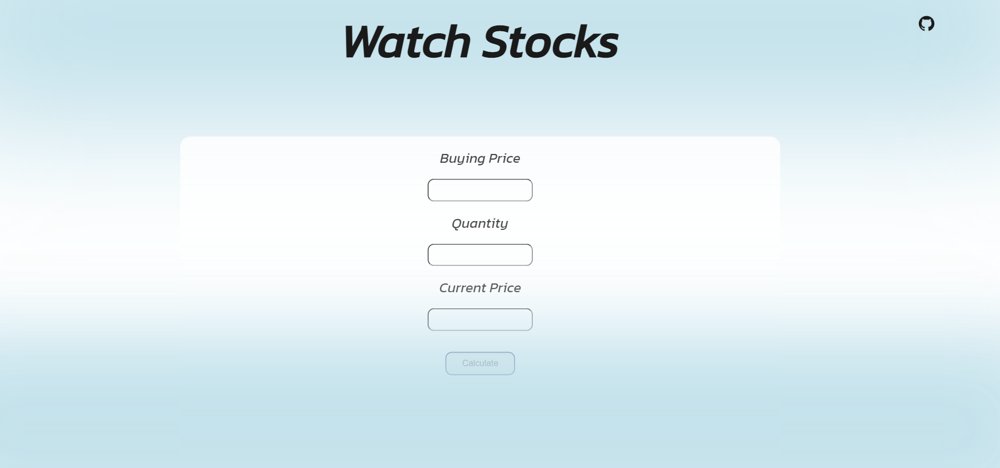
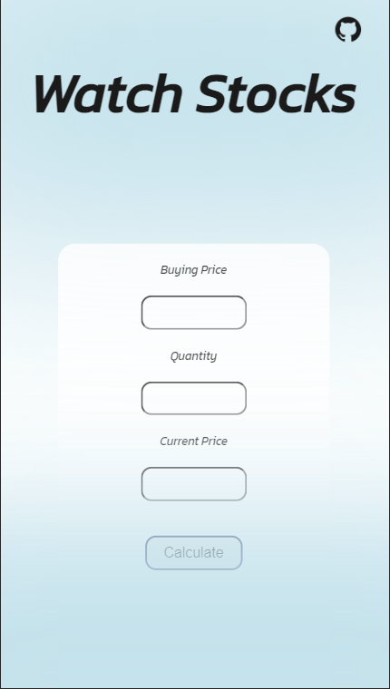

# 📈 Watch Stocks 📉

## Check out [👉 Live here 👈](https://dcs-watchstocks.netlify.app/)

---

## ✨ **About** 

Watch Stocks can be used to calculate the Profit and Loss of the current holdings in your portfolio.

-> Enter buying price of stock.  
-> Enter selling price of stock.  
-> Enter quantity of the stock.  
-> Wait for the result.  

## 💻 **Built with**

  

&nbsp;

😉 **Glimpses**

&nbsp; &nbsp; &nbsp; 

---
